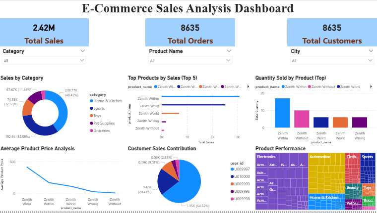
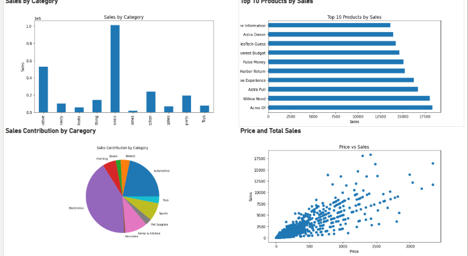

# E-Commerce Sales Analysis 

## Project Overview
This is a Power BI project analyzing e-commerce sales data through data cleaning, modelling, DAX calculations, and interactive visualizations. 

## E-Commerce Sales Dashboard Preview

## Python Visualization Preview

An Exploratory Data Analysis (EDA) and Business Intelligence project using Power BI to analyse e-commerce sales data and generate actionable insights on sales performance, customers, and products.

The project includes data cleaning, data modelling, DAX calculations, dashboard development and Python visualization.

## Tools Used

- Microsoft Power BI
- Power Query
- DAX
- Python (Power BI Visuals)

## Dataset

The analysis uses:

- Customer Dataset
- Sales Dataset
- Product Dataset

Data was cleaned and transformed using Power Query.

A relational model was created:

- Customers → Sales
- Products → Sales

The Sales table served as the main transaction table.

## Analysis & Dashboard

Created 15 DAX measures including:

## DAX Measures Created

15 DAX measures were created to analyse e-commerce sales performance:

## DAX Measures Created

15 DAX measures were created to analyse e-commerce sales performance:

- Total Sales
- Total Orders
- Total Customers
- Total Quantity Sold
- Average Order Value
- Average Sales per Customer
- Maximum Sales
- Minimum Sales
- Product Count
- Average Product Price
- Quantity Analysis
- Order Status Analysis
- Lowest Quantity Sold
- Highest Quantity Sold
- Category Sales

Dashboard features:

### KPI Cards
- Total Sales
- Total Orders
- Total Customers

### Slicers
- Category
- Product Name
- Customer/User ID

### Visuals

- Sales by Category (Donut Chart)
- Top Products by Sales (Bar Chart)
- Quantity Sold by Product (Column Chart)
- Average Product Price (Line Chart)
- Product Performance (Treemap)
- Customer Sales Contribution (Pie Chart)

## Python Visualizations

Created Python-based visuals:

- Sales by Category
- Top 10 Products by Sales
- Sales Contribution by Category
- Price vs Sales Relationship

## Key Insights

The analysis highlights:

- Best-performing products and categories
- Customer revenue contribution
- Sales distribution patterns
- Relationship between pricing and sales

## Conclusion

This project demonstrates an end-to-end data analytics workflow, transforming raw e-commerce data into interactive dashboards and business insights using Power BI.
